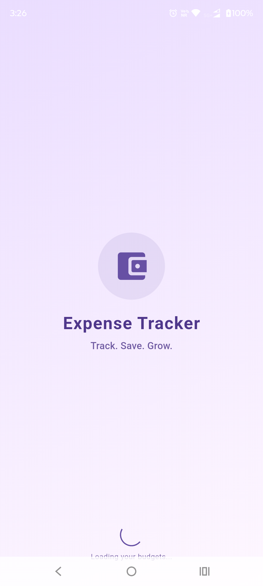
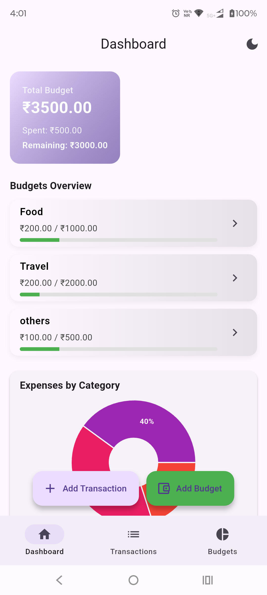
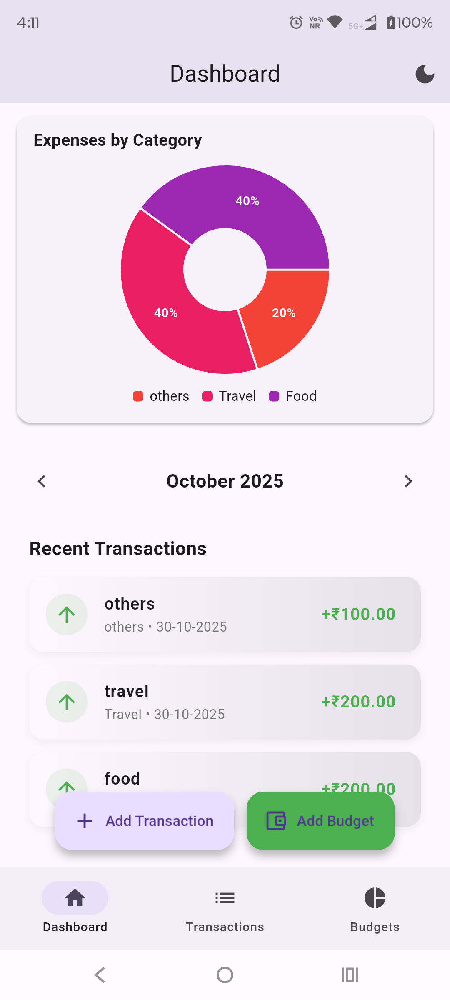
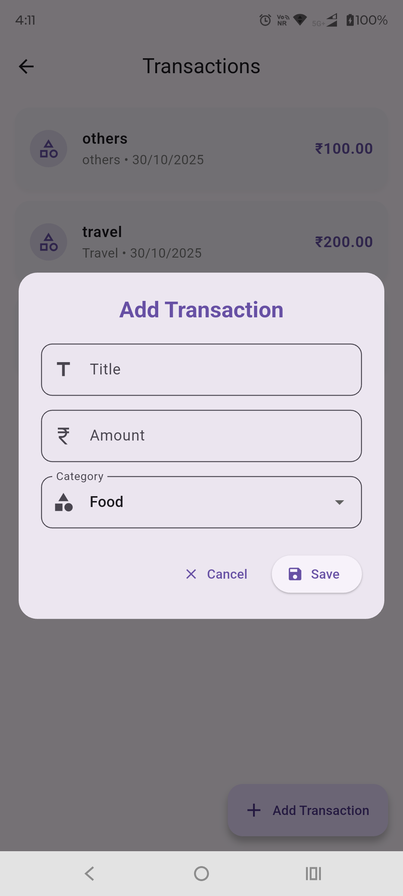
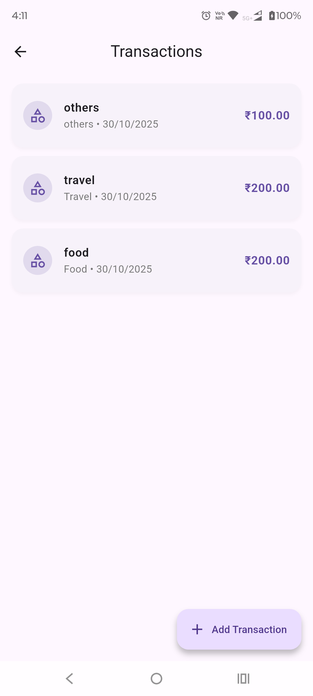
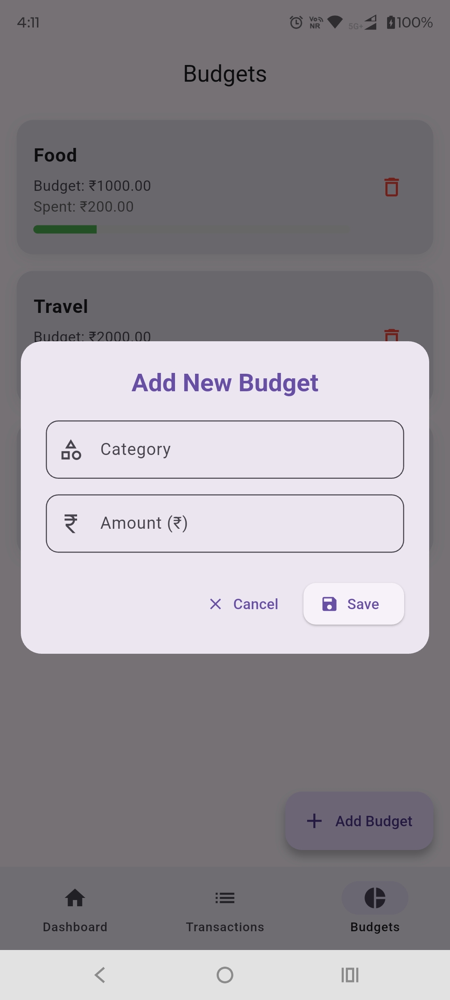
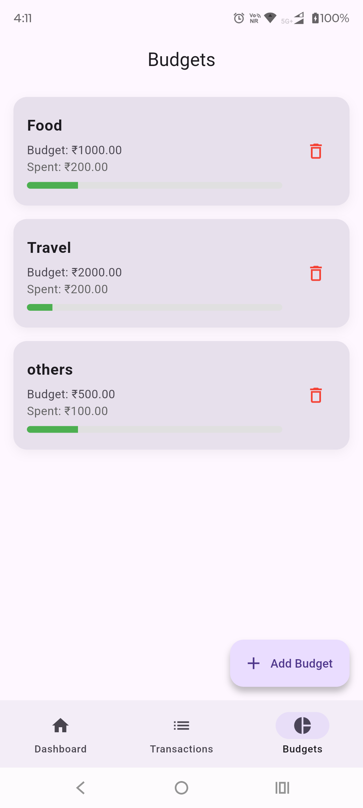

## Getting Started

This project is a starting point for a Flutter application.

# 💰 Expense Tracker App

A modern and intuitive **Expense Tracker** built using **Flutter** and **BLoC (Business Logic Component)** with **Clean Architecture**.  
Easily manage your daily expenses, track income, and visualize spending trends through rich analytics.

---

## 🧭 Features

- 📝 Add and delete transactions entries
- 💸 Add and delete budget(Limit amount) with categories
- 📊 Monthly and category-wise spending charts 
- 💾 Local data persistence using SQLite
- 🌗 Adaptive light & dark themes
- 🧱 Scalable architecture for API or cloud integration

---

## 🧱 Tech Stack

| Layer | Technology |
|-------|-----------|
| **Architecture** | Architecture (Domain → Data → Presentation) |
| **State Management** | BLoC (flutter_bloc) |
| **Local Storage** |  SQLite |
| **UI Framework** | Flutter 3.29 |
| **Charts** | fl_chart |
| **Date Formatting** | intl |

---

A few resources to get you started if this is your first Flutter project:

- [Lab: Write your first Flutter app](https://docs.flutter.dev/get-started/codelab)
- [Cookbook: Useful Flutter samples](https://docs.flutter.dev/cookbook)

For help getting started with Flutter development, view the
[online documentation](https://docs.flutter.dev/), which offers tutorials,
samples, guidance on mobile development, and a full API reference.

